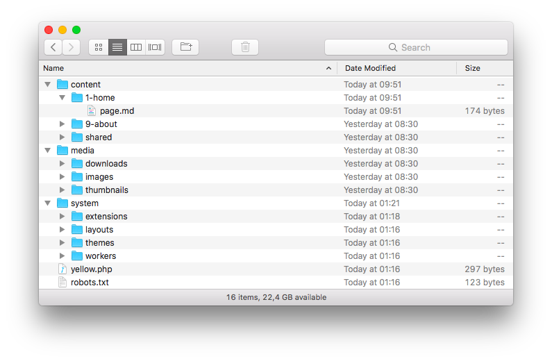

<a href="README-de.md">Deutsch</a> &nbsp; <a href="README.md">English</a> &nbsp; <a href="README-sv.md">Svenska</a>

# Core 0.9.17

Kernfunktionalität deiner Webseite.

## Wie man eine Erweiterung installiert

[ZIP-Datei herunterladen](https://github.com/annaesvensson/yellow-core/archive/refs/heads/main.zip) und in dein `system/extensions`-Verzeichnis kopieren. [Weitere Informationen zu Erweiterungen](https://github.com/annaesvensson/yellow-update/tree/main/README-de.md).

## Wie man eine Webseite auf dem Computer bearbeitet

Du kannst deine Webseite im Texteditor bearbeiten. Das `content`-Verzeichnis enthält die [Inhaltsdateien](https://datenstrom.se/de/yellow/help/how-to-change-the-content) der Webseite. Hier bearbeitet man seine Webseite. Das `media`-Verzeichnis enthält die [Mediendateien](https://datenstrom.se/de/yellow/help/how-to-change-the-media) der Webseite. Hier speichert man seine Bilder und Dateien. Das `system`-Verzeichnis enthält die [Systemdateien](https://datenstrom.se/de/yellow/help/how-to-change-the-system) der Webseite. Hier findet man Konfigurationsdateien.

Ganz oben auf einer Seite kannst du `Title` und andere [Seiteneinstellungen](#einstellungen-seite) ändern. Darunter kannst du Text und Bilder ändern. Falls du einen anderen Seitentitel in der Navigation anzeigen willst, benutze `TitleNavigation` mit einem kurzen Titel für die Navigation. Textformatierung mit Markdown wird unterstützt. HTML wird auch unterstützt. [Weitere Informationen zu Textformatierung](https://datenstrom.se/de/yellow/help/how-to-change-the-content).

## Wie man eine Webseite anpasst

Du kannst deine Webseite in den [Systemeinstellungen](#einstellungen-system) anpassen, beispielsweise den Namen der Webseite. Die Systemeinstellungen enthalten die Einstellungen der Webseite und aller installierten Erweiterungen. Bei einer Neuinstallation werden `Sitename`, `Author`, `Email` und `Language` automatisch festgelegt. Alle Systemeinstellungen werden in der Datei `system/extensions/yellow-system.ini` gespeichert.

Die zweite Möglichkeit besteht darin, deine Webseite mit HTML und CSS anzupassen. Alle HTML-Dateien befinden sich im `system/layouts`-Verzeichnis. Alle CSS-Dateien befinden sich im `system/themes`-Verzeichnis. Du kannst diese Dateien beliebig ändern und auch deine eigenen Dateien hinzufügen. Deine Änderungen werden bei der Aktualisierung der Webseite nicht überschrieben. [Weitere Informationen zu Layouts](https://datenstrom.se/de/yellow/help/how-to-customise-a-layout) und [Themes](https://datenstrom.se/de/yellow/help/how-to-customise-a-theme).

Die dritte Möglichkeit besteht darin, deine Webseite mit Erweiterungen anzupassen. Das gibt dir die Möglichkeit nahezu jeden Aspekt des Systems anzupassen. Die Idee dahinter ist, dass die Standardinstallation die wichtigsten Dinge für kleine Webseiten beinhaltet. Du kannst später weitere Funktionen hinzufügen. Wir verwenden überall die gleiche API, von Layoutdateien bis zu Erweiterungen. [Weitere Informationen zu Erweiterungen](https://github.com/annaesvensson/yellow-update/tree/main/README-de.md) und [Erstellen von Erweiterungen](https://github.com/annaesvensson/yellow-publish/tree/main/README-de.md).

## Wie man eine Webseite aktualisiert

Du kannst deine Webseite im Webbrowser oder der Befehlszeile aktualisieren. Du findest Informationen über [neuste Produktänderungen](https://datenstrom.se/de/yellow/help/what-s-new) in der Hilfe. Denke daran dass nur verfügbare Erweiterungen aktualisiert werden, möglicherweise musst du experimentelle Erweiterungen manuell aktualisieren. [Weitere Informationen zum Aktualisieren](https://github.com/annaesvensson/yellow-update/tree/main/README-de.md).

## Wie man eine Seite versteckt

Ganz oben auf einer Seite kannst du `Status: unlisted` in den [Seiteneinstellungen](#einstellungen-seite) festlegen. Die Seite ist dann in der Navigation, der Sitemap und Suchergebnissen nicht mehr sichtbar. Du kannst zwischen verschiedenen [Statuswerten](#einstellungen-status) wählen, um zu bestimmen wer eine Seite sehen und darauf zugreifen kann.

## Wie man eine Seite weiterleitet

Ganz oben auf einer Seite kannst du `Redirect` in den [Seiteneinstellungen](#einstellungen-seite) festlegen. Die Seite wird dann zu einer anderen Seite oder URL weitergeleitet. Du kannst die Seite weiterhin im [Webbrowser](https://github.com/annaesvensson/yellow-edit/tree/main/README-de.md) und auf deinem Computer bearbeiten.

## Wie man die Fehlerseite ändert

Eine Fehlerseite wird bei fehlenden Dateien angezeigt. Du kannst die Fehlerseite ändern indem du die Datei `content/shared/page-error-404.md` bearbeitest. Bei einer statischen Webseite musst du eventuell deinen Webserver so konfigurieren dass er die erzeugte `404.html`-Datei anzeigt.

## Wie man die Befehlszeile benutzt

Du kannst Befehle in der Befehlszeile ausführen. Das gibt dir beispielsweise die Möglichkeit [einen Webserver zu starten](https://github.com/annaesvensson/yellow-serve/tree/main/README-de.md) und [eine statische Webseite zu generieren](https://github.com/annaesvensson/yellow-generate/tree/main/README-de.md). Die verfügbaren Befehle hängen von den installierten Erweiterungen ab. Öffne ein Terminalfenster. Gehe ins Installations-Verzeichnis, dort wo sich die Datei `yellow.php` befindet. Gib ein `php yellow.php`, um die verfügbaren Befehle anzuzeigen.

Die folgenden Befehle sind verfügbar:

`php yellow.php about` = Erweiterungen anzeigen, [erfordert Update-Erweiterung](https://github.com/annaesvensson/yellow-update/tree/main/README-de.md)  
`php yellow.php check` = Defekte Links finden, [erfordert Check-Erweiterung](https://github.com/annaesvensson/yellow-check/tree/main/README-de.md)  
`php yellow.php clean` = Statische Webseite löschen, [erfordert Generate-Erweiterung](https://github.com/annaesvensson/yellow-generate/tree/main/README-de.md)  
`php yellow.php generate` = Statische Webseite generieren, [erfordert Generate-Erweiterung](https://github.com/annaesvensson/yellow-generate/tree/main/README-de.md)  
`php yellow.php install` = Erweiterungen installieren, [erfordert Update-Erweiterung](https://github.com/annaesvensson/yellow-update/tree/main/README-de.md)  
`php yellow.php publish` = Erweiterungen veröffentlichen, [erfordert Publish-Erweiterung](https://github.com/annaesvensson/yellow-publish/tree/main/README-de.md)  
`php yellow.php serve` = Webserver starten, [erfordert Serve-Erweiterung](https://github.com/annaesvensson/yellow-serve/tree/main/README-de.md)  
`php yellow.php traffic` = Zugriffsanalysen erstellen, [erfordert Traffic-Erweiterung](https://github.com/annaesvensson/yellow-traffic/tree/main/README-de.md)  
`php yellow.php uninstall` = Erweiterungen deinstallieren, [erfordert Update-Erweiterung](https://github.com/annaesvensson/yellow-update/tree/main/README-de.md)  
`php yellow.php update` = Erweiterungen aktualisieren, [erfordert Update-Erweiterung](https://github.com/annaesvensson/yellow-update/tree/main/README-de.md)  
`php yellow.php user` = Benutzerkonten erstellen, [erfordert Edit-Erweiterung](https://github.com/annaesvensson/yellow-edit/tree/main/README-de.md)  

## Beispiele

Inhaltsdatei mit normaler Seite:

    ---
    Title: Normale Seite
    ---
    Das ist eine Beispielseite.

    Lorem ipsum dolor sit amet, consectetur adipisicing elit, sed do eiusmod 
    tempor incididunt ut labore et dolore magna pizza. Ut enim ad minim veniam, 
    quis nostrud exercitation ullamco laboris nisi ut aliquip ex ea commodo.

Inhaltsdatei mit kurzem Titel:

    ---
    Title: Beispielseite
    TitleNavigation: Beispiel
    ---
    Das ist eine Beispielseite mit einem kurzen Titel für die Navigation.

    Lorem ipsum dolor sit amet, consectetur adipisicing elit, sed do eiusmod 
    tempor incididunt ut labore et dolore magna pizza. Ut enim ad minim veniam, 
    quis nostrud exercitation ullamco laboris nisi ut aliquip ex ea commodo.

Inhaltsdatei mit ungelisteter Seite:

    ---
    Title: Ungelistete Seite
    Status: unlisted
    ---
    Diese Seite ist in der Navigation, der Sitemap und Suchergebnissen nicht sichtbar.

Inhaltsdatei mit Weiterleitung:

    ---
    Title: Seite weiterleiten
    Redirect: https://datenstrom.se/de/yellow/
    ---
    Diese Seite wird zu einer anderen Seite weitergeleitet.

Inhaltsdatei für Fehlerseite:

    ---
    Title: Datei nicht gefunden
    Layout: error
    ---
    Die angeforderte Datei wurde nicht gefunden. Oh nein …

Layoutdatei für Standard-Seite:

    <?php $this->yellow->layout("header") ?>
    

    

    <h1><?php echo $this->yellow->page->getHtml("titleContent") ?></h1>
    <?php echo $this->yellow->page->getContentHtml() ?>
    

    

    <?php $this->yellow->layout("footer") ?>

## Einstellungen

Die folgenden Einstellungen können in der Datei `system/extensions/yellow-system.ini` vorgenommen werden:

`Sitename` = Name der Webseite  
`Author` = Name des Webmasters  
`Email` = E-Mail des Webmasters  
`Language` = Standard-Sprache, z.B. `de`  
`Layout` = Standard-Layout  
`Theme` = Standard-Theme  
`Parser` = Standard-Inhaltsparser  
`Status` = Standard-Seitenstatus, [unterstützte Statuswerte](#einstellungen-status)  
`CoreServerUrl` = URL der Webseite, `auto` für automatische Erkennung  
`CoreTimezone` = Zeitzone der Webseite, [unterstützte Zeitzonen](https://www.php.net/manual/de/timezones.php)  
`CoreContentExtension` = Dateiendung für den Inhalt  
`CoreContentDefaultFile` = Inhaltsdatei für Verzeichnisse  
`CoreContentErrorFile` =  Inhaltsdatei für Fehlerseite  
`CoreLanguageFile` = Datei mit Spracheinstellungen  
`CoreUserFile` = Datei mit Benutzereinstellungen  
`CoreWebsiteFile` = Logdatei der Webseite  
`CoreAssetLocation` = Ort für virtuell zugeordnete Systemdateien  
`CoreMediaLocation` = Ort für Mediendateien  
`CoreDownloadLocation` = Ort für Dateien zum Herunterladen  
`CoreImageLocation` = Ort für Bilder  
`CoreThumbnailLocation` = Ort für Miniaturbilder  
`CoreMultiLanguageMode` = Mehrsprachen-Modus aktivieren, 1 oder 0  
`CoreDebugMode` = Debug-Modus aktivieren, 0 bis 3  

Die folgenden Einstellungen können ganz oben auf einer Seite vorgenommen werden:

`Title` = Seitentitel  
`TitleContent` = Seitentitel der im Inhalt angezeigt wird  
`TitleNavigation` = Seitentitel der in der Navigation angezeigt wird  
`TitleHeader` = Seitentitel der im Webbrowser angezeigt wird  
`TitleSlug` = Seitentitel zum Speichern der Seite  
`Description` = Beschreibung der Seite  
`Author` = Autoren der Seite, durch Komma getrennt  
`Email` = E-Mail des Seitenautors  
`Language` = Sprache der Seite, z.B. `de`  
`Layout` = Layout der Seite  
`LayoutNew` = Layout um eine neue Seite zu erzeugen  
`Theme` = Theme der Seite  
`Parser` = Inhaltsparser der Seite  
`Status` = Status der Seite, [unterstützte Statuswerte](#einstellungen-status)  
`Redirect` = Weiterleitung zu einer anderen Seite oder URL  
`Image` = Bild der Seite  
`ImageAlt` = Beschreibung des Bildes der Seite  
`Modified` = Änderungsdatum der Seite, JJJJ-MM-TT Format  
`Published` = Veröffentlichungsdatum der Seite, JJJJ-MM-TT Format  
`Tag` = Tags zur Kategorisierung der Seite, durch Komma getrennt  
`Generate` = Optionen zum Generieren einer statischen Webseite, durch Komma getrennt  
`Comment` = Optionen zum Anzeigen von Kommentaren, durch Komma getrennt  

Die folgenden Seiten-Statuswerte werden unterstützt:

`public` = Seite ist eine normale Seite  
`private` = Seite ist nicht sichtbar, Benutzer muss das Kennwort eingeben, [erfordert Private-Erweiterung](https://github.com/schulle4u/yellow-private/tree/main/README-de.md)  
`draft` = Seite ist nicht sichtbar, Benutzer muss sich einloggen, [erfordert Draft-Erweiterung](https://github.com/annaesvensson/yellow-draft/tree/main/README-de.md)  
`unlisted` = Seite ist nicht sichtbar, aber kann mit dem richtigen Link abgerufen werden  
`shared` = Seite ist nicht sichtbar, aber kann in andere Seiten eingebunden werden  

Die folgenden Dateien können angepasst werden:

`content/1-home/page.md` = Inhaltsdatei für die Startseite  
`content/shared/page-error-404.md` = Inhaltsdatei für Fehlerseite  
`system/layouts/default.html` = Layoutdatei für Standard-Seite  
`system/layouts/error.html` = Layoutdatei für Fehler-Seite  
`system/layouts/header.html` = Layoutdatei für Standard-HTML-Header  
`system/layouts/footer.html` = Layoutdatei für Standard-HTML-Footer  
`system/layouts/navigation.html` = Layoutdatei für Standard-HTML-Navigation  
`system/layouts/pagination.html` = Layoutdatei für Standard-HTML-Paginierung  

Die folgenden Dateien sind wichtig für die Funktionsweise der Webseite:

`system/extensions/yellow-system.ini` = Datei mit Systemeinstellungen  
`system/extensions/yellow-language.ini` = Datei mit Spracheinstellungen  
`system/extensions/yellow-user.ini` = Datei mit Benutzereinstellungen  
`system/extensions/yellow-website.log` = Logdatei der Webseite  

## Danksagung

Diese Erweiterung wurde zuvor betreut von Mark Seuffert und David Fehrmann. Danke für die gute Arbeit.

## Entwickler

Anna Svensson. [Hilfe finden](https://datenstrom.se/de/yellow/help/).
